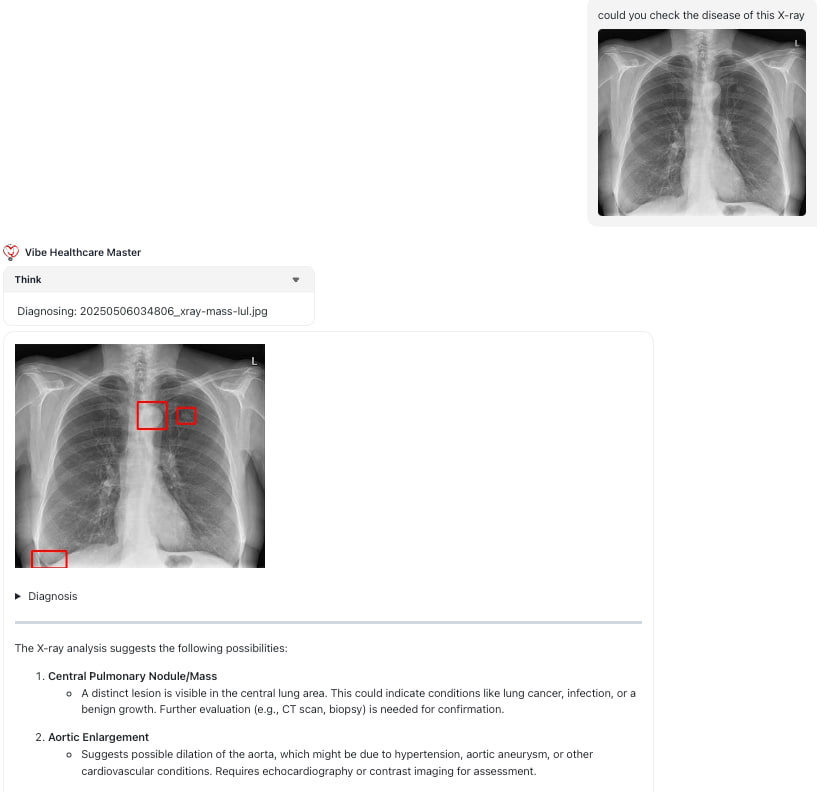
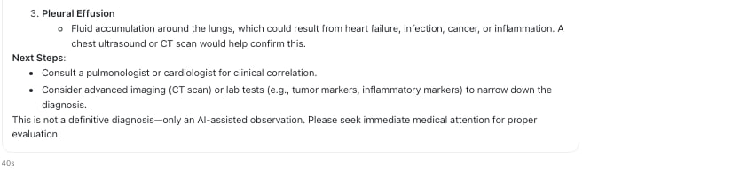
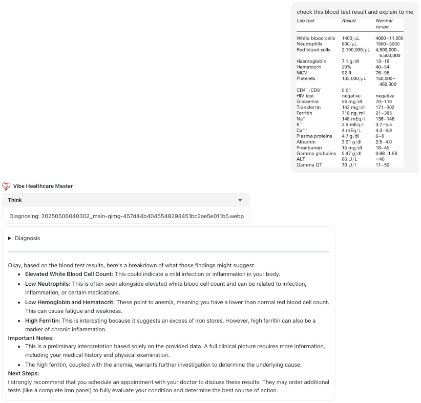
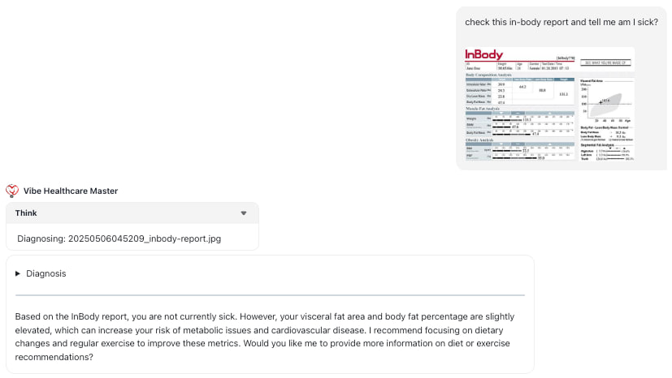
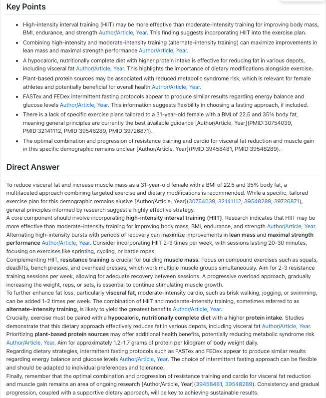
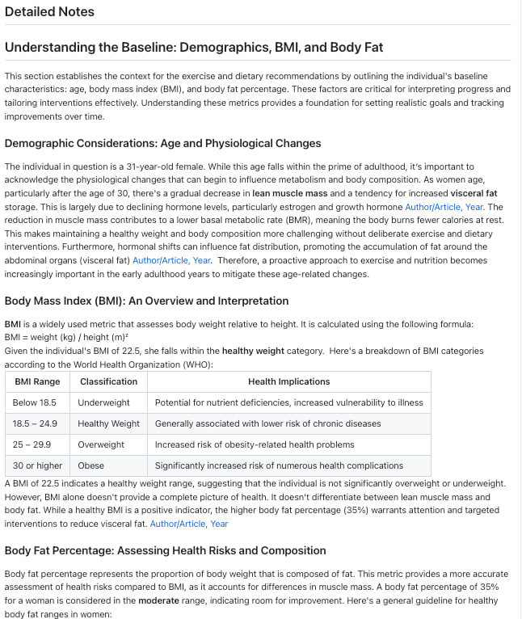

# Vibe Healthcare Master

Vibe Healthcare Master is an AI-powered healthcare assistant designed to provide medical information, analyze X-ray images, and facilitate medical research. The goal of this agent is to assist healthcare professionals and patients with various medical inquiries and diagnostic support.

## Key Features

- **Medical Question Answering**: the agent can answer questions related to medical conditions, symptoms, treatments, and procedures, drawing on real-time medical databases.
- **X-ray Image Analysis**: the agent uses a YOLOv11 model for detecting potential lesions and abnormalities in X-ray images. Please be aware that this analysis is for informational purposes only and does not replace a professional radiologist's interpretation.
- **Real-time Information Search**: the agent can perform quick searches on the Internet to find the most up-to-date information.

## Usage

1. Provide a clear and concise description of your medical question, concern, or the X-ray image you wish to analyze.
2. For X-ray image analysis, please provide the image data.
3. The agent will process your request and provide a response, potentially including tool calls to access additional information or analysis.

## Installation

First, build the Docker image:

```bash
docker build -t vibe-healthcare-master .
```

Then, start the container:

```bash
docker run --rm -it -p 4000:80 \
-e LLM_BASE_URL=<your-llm-base-url> \ # openai compatible server
-e LLM_API_KEY=<your-llm-api-key> \ # optional: no needed if using local model 
-e LLM_MODEL_ID=<llm-model> \ # optional: no needed if using local model
-e EMBEDDING_MODEL_ID=<embedding-model> \ # optional: for deepsearch
-e PROXY_SCOPE='*api.tavily.com*' \
vibe-healthcare-master
```

Example payload for the agent:

Raw text:

```bash
curl -X POST http://localhost:4000/prompt -d '
{
   "messages": [
      {
         "role": "user",
         "content": "who are you?"
      }
   ]
}
' # not tested
```

With attachment

```bash
curl -X POST http://localhost:4000/prompt -d '
{
   "messages":[
      {
         "role": "user",
         "content": [
            {
               "type": "text",
               "text": "check this X-ray and tell me some abnormalities "
            },
            {
               "type": "image_url",
               "image_url": {
                  "url":"data:image/jpeg;base64,{{base64_utf8_str}}",
                  "detail":"",
                  "name":"xray-mass-lul.jpg"
               }
            }
         ]
      }
   ]
}
' # not tested 
```

## Demo

### X-ray Image Analysis

The agent can analyze X-ray images and provide detailed information about the findings. An example is in the following images.

<p align="center">

</p>

<p align="center">

</p>

### Blood Test Analysis

The agent can analyze blood test results and provide detailed information about the findings. An example is in the following image.

<p align="center">

</p>

### InBody Report Analysis

The agent can analyze InBody reports and provide detailed information about the findings. An example is in the following image.

<p align="center">

</p>

### Deep Research

Moreover, the agent can conduct deep research to provide more accurate medical advice. An example is in the following image.

<p align="center">

</p>

<p align="center">

</p>

## Disclaimer

This should only be treated as an assistant, and not an official replacement for doctors/medical professionals. Always consult with a qualified healthcare provider for any medical advice or treatment.
